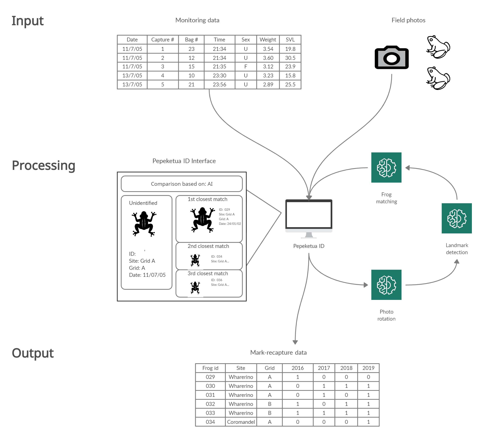
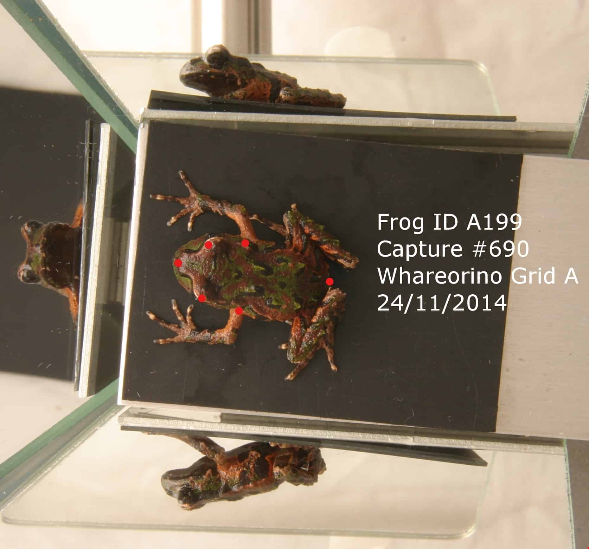

==================
Landmark detection - Pepeketua ID
==================

Pepeketua ID is an open-source pattern recognition software that facilitates the individual identification of New Zealand endemic frogs (Pepeketua).

    
You can find out more about the project at https://www.wildlife.ai/projects/pepeketua-id/

Overview
------------

This repository contains scripts related to the Landmark Detection component of the Pepeketua ID. 

SUMMARY OF THE REPO

   
Example of the landmarks (red points) produced by the model.  

Quickstart
--------------------

.. image:: https://mybinder.org/badge_logo.svg
   :target: https://mybinder.org/v2/gh/wildlifeai/pepeketua_landmarks/HEAD

Requirements
------------

* Python 3.7+
* Python dependencies listed in requirements.txt

Instructions
-------------------------

Summary instructions
~~~~

Citation
--------

If you use this code or its models in your research, please cite:

Hay G, Carmon E, Vinograd B, Anton V (2021). An open-source landmark detection model approach to facilitate the individual identification of New Zealand endemic frogs. https://github.com/wildlifeai/pepeketua_landmarks

Collaborations/questions
~~~~~~~~~~~~

We are working to make our work available to other herpetologits. Please feel free to `contact us`_ with your questions.

.. _contact us: contact@wildlife.ai
